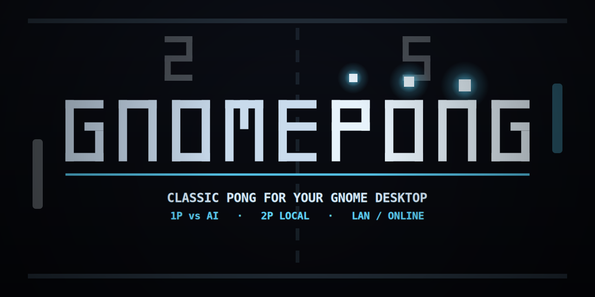
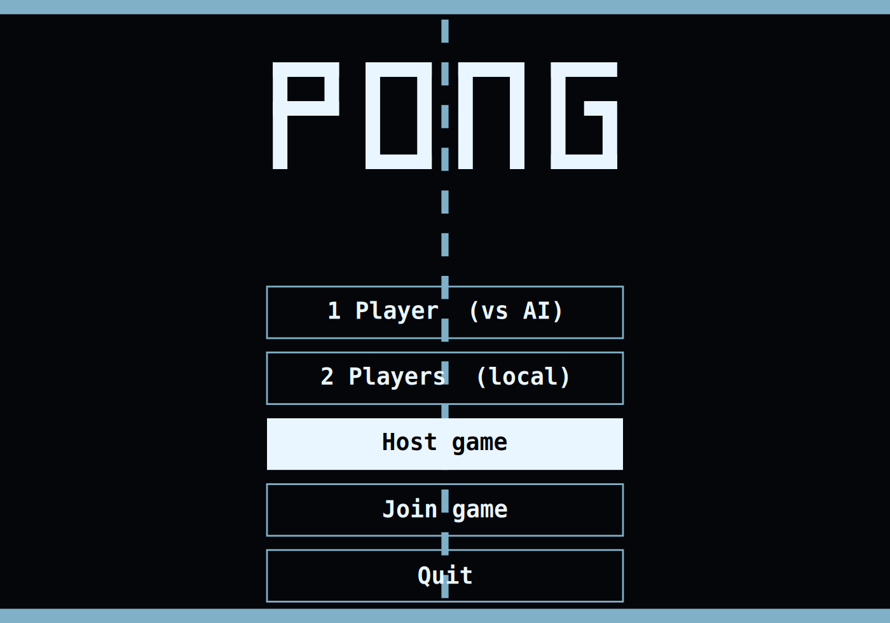
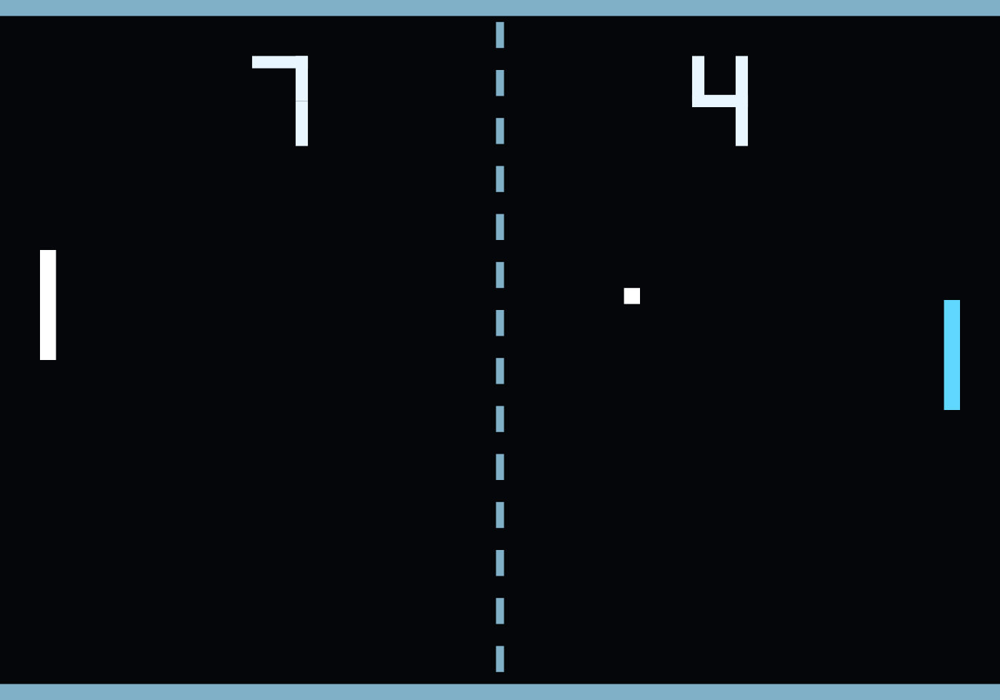
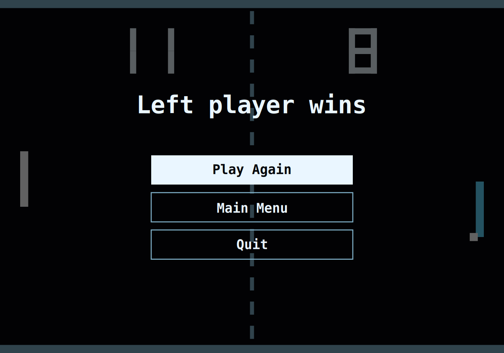

<p align="center">
  
</p>

<p align="center">
  <b>Classic <a href="https://en.wikipedia.org/wiki/Pong">Pong</a>, right in your GNOME Shell panel.</b><br>
  A <b>PONG</b> button in the top bar drops you into a full-screen retro court —
  black field, dashed net, blocky 7-segment scores. Play the AI, a friend on the
  same keyboard, or someone across the network.
</p>

<p align="center">
  
  
  
</p>

---

## Screenshots

<p align="center">
  
  
</p>
<p align="center">
  
</p>

## Features

- 🕹️ **1 Player vs AI** — you control the left paddle with the **mouse** against a balanced computer opponent.
- 👥 **2 Players (local)** — left paddle **W/S**, right paddle **↑/↓**, on one keyboard.
- 🌐 **Direct-connect multiplayer** — one player **hosts** on a port, the other **joins** by `IP:port` with a shared secret. Host-authoritative, JSON-over-UDP over Gio sockets, **no relay server**. Works on a LAN (host's LAN IP) or over the internet (a forwarded / public port) — same code path.
- 🔊 **Classic blips** — square-wave sounds for paddle hits, wall bounces, and points (toggleable).
- 🏁 **First to 11**, configurable to **5 / 11 / 21**.
- 🎨 **Recolor everything** — background, net/walls, ball, each paddle, and the score, from Preferences. Choices persist via **GSettings**.
- 🖥️ **Resolution-independent** — a fixed virtual court is scaled and letterboxed to any monitor, so physics behave identically everywhere.

## How to play

Open and close the game from the **PONG** button in the top panel.

| Action            | Control                          |
| ----------------- | -------------------------------- |
| Move paddle (1P / online) | **Mouse**                |
| Left paddle (2P)  | **W** / **S**                    |
| Right paddle (2P) | **↑** / **↓**                    |
| Serve             | **Space**                        |
| Pause / resume    | **P**                            |
| Restart match     | **R**                            |
| Menu / back / quit | **Esc**                         |

Menus are navigable with the **mouse** (hover + click) or the **keyboard**
(↑/↓ + Enter, or number keys on the main menu).

### Playing online

1. One player picks **Host game**. GnomePong shows the address (`ip:port`) and an
   auto-generated **secret**.
2. The other player picks **Join game**, enters that address and secret, and
   connects. The host is the **left** paddle, the joiner is the **right** — both
   steer with the mouse.
3. On a LAN, use the host's LAN IP. Over the internet, forward the host's port
   (default **7777**) and share the public IP. The secret gates uninvited joins.

## Requirements

- GNOME Shell **50** (Wayland or X11)

## Install

GnomePong is a standard GNOME Shell extension (modern ESM style). The installable
extension is the `gnomepong@vanvonvan.github.io/` directory.

```sh
git clone git@github.com:vanvonvan/GnomePong.git
cd GnomePong

# Compile the schema and symlink the extension into your local extensions dir:
make link
```

Then restart GNOME Shell so it picks up the new extension, and enable it:

- **Xorg:** `Alt`+`F2`, type `r`, `Enter`.
- **Wayland:** log out and back in (the Shell can't hot-reload under Wayland).

```sh
gnome-extensions enable gnomepong@vanvonvan.github.io
```

Open **Preferences** (via the Extensions app) to recolor the court, set the
winning score, and toggle sound.

## Development

```sh
make test      # headless engine + renderer logic tests (gjs, no shell needed)
make preview   # play in a standalone GTK4 window (reuses the real engine/renderer)
make nested    # visible, isolated nested GNOME Shell with GnomePong enabled
make pack      # build a distributable zip
```

On Wayland the running shell can't hot-reload, so `make preview` (a standalone
window reusing the exact game modules) is the quickest way to play-test a change;
`make nested` launches a throwaway nested shell that never touches your live
session's settings. (`gnome-shell --devkit` intentionally disables user
extensions, so it is *not* used for testing this extension.)

The art and screenshots are reproducible: `python3 tools/gen_art.py` regenerates
the icon/logo/banner, and `gjs -m tools/gen_screens.js` renders the screenshots
by driving the real `lib/render.js`.

## Layout

The extension itself lives in the UUID-named directory
`gnomepong@vanvonvan.github.io/`; dev tooling and tests stay at the repo root.

```
gnomepong@vanvonvan.github.io/   the installable extension (this dir is what ships)
  extension.js        panel button + enable/disable
  prefs.js            libadwaita preferences (colors, win score, sound)
  stylesheet.css      overlay + join-form styling
  metadata.json       extension manifest
  lib/constants.js    dimensions, physics constants, settings keys
  lib/game.js         pure Pong simulation (engine reused by netplay)
  lib/ai.js           balanced AI paddle controller
  lib/render.js       Cairo rendering of the court
  lib/menu.js         canvas menu model (main/pause/game-over)
  lib/overlay.js      full-screen overlay: actors, input, frame loop, net UI
  lib/sound.js        blip playback via the shell sound player
  lib/net.js          direct-connect UDP host/client (JSON over Gio sockets)
  lib/netgame.js      host-authoritative netplay over net.js + engine
  schemas/            GSettings schema
  sounds/             generated WAV blips (see tools/gen_sounds.py)
tests/              headless gjs smoke tests (engine, render, net, netgame)
tools/              preview.js, run-nested.sh, gen_sounds.py, gen_art.py, gen_screens.js
assets/             banner / logo / icon + screenshots (for GitHub)
```

## Credits

- **Built by [Claude](https://claude.com/claude-code)** (Anthropic's Claude Code) — the extension, from gameplay and networking to the artwork, branding, and this README, was designed and implemented by Claude in collaboration with the repo owner.
- Built with **GJS** on **GNOME Shell**, drawn with **St** + **Cairo**, networked over **Gio** sockets.

## License

Released under the **GNU GPL v2.0 or later**, the standard for GNOME Shell extensions. See [LICENSE](LICENSE).
